### Quantitative Researcher · Alpha Signal Design · AI/ML Engineering

I build quant alpha signals and ML systems, validated the way live trading platforms validate them — not the way tutorials do.

[LinkedIn](https://linkedin.com/in/vignesh-kumar-u-65442b256) · [Portfolio](https://vignesh-kumar-u.netlify.app) · [Email](mailto:vigneshkumaru06@gmail.com)

 

## Now

- 🔬 Researching alpha signals on **WorldQuant BRAIN** across USA, EUR, KOR, ASI, IND, CHN — 60+ submitted models
- 🏆 Top 1% (2,731 / 292,000+) in WorldQuant Challenge 2026 · Stage 2 Qualifier, IQC 2026 (top 20%)
- 📄 First-author paper (**RakshaSetu**) accepted & presented at IEEE CONIT 2026
- 🎓 B.Tech, AI & Data Science — graduated May 2026
- 🎯 Open to quant research, data science, and AI/ML engineering roles

 

## Featured Work

**[PaperPulse](https://github.com/viki22uied/PaperPulse)** — Research-paper trust-scoring engine
Applies alpha-validation rigor from quant research to score and digest academic papers using NLP-derived trust signals.
`Python` `NLP` `Quant Signal Design`

**RakshaSetu** — Smart tourist safety monitoring system *(IEEE CONIT 2026, first author)*
LSTM-autoencoder anomaly detection on GPS trajectories (92% accuracy, sub-2s alerts) with geo-fencing and a blockchain identity layer, tested on 250K+ simulated GPS samples.
`LSTM` `Geo-Fencing` `Solidity`

**Hercules Finance AI** — Financial planning for gig workers *(Top 30, SEBI Global FinTech Festival)*
Income forecasting for irregular earners, sentiment-based distress detection, and multilingual (EN/HI/MR) UPI simulation.
`FastAPI` `React` `Gemini`

**Financial Crime Detection Pipeline** — Graph-based suspicious-network detection
Strongly-connected-components and betweenness-centrality analysis over 1M+ transactions, with an interactive Tableau drill-down dashboard.
`Scikit-learn` `NetworkX` `Tableau`

More projects

 

**LEARNING-AID** — Semantic OER recommendation system using Whisper transcription, spaCy/KeyBERT concept extraction, and FAISS/Qdrant vector search benchmarked over 1,000+ resources.

**DeepWork AI** — Hardware-triggered focus-session desktop app *(Top 50, Logitech Dev Studio Hackathon)*; browser workspace capture/restore and a TF-IDF + logistic-regression notification triage dashboard.

 

## Stack

| Area | Tools |
|---|---|
| Quant / Research | `Python`, `R`, Statistical Modeling, Time-Series Analysis |
| AI/ML | PyTorch, Scikit-learn, FAISS, Qdrant, spaCy, Whisper |
| Backend | FastAPI, PostgreSQL, Docker, Redis, Kafka |

 

## Recognition

| | |
|---|---|
| **WorldQuant Challenge 2026** | Top 1% — Gold (2,731 / 292,000+) |
| **IEEE CONIT 2026** | First author — RakshaSetu |
| **SEBI Global FinTech Festival** | Top 30 nationally |
| **IIT Madras Design Blitz** | 1st Runner-Up |
| **Logitech Dev Studio Hackathon** | Top 50 globally |

Also published at IEEE ISAECT 2025 (IEEE Xplore, [DOI](https://doi.org/10.1109/ISAECT68904.2025.11318700)) · Mumbai Hacks 2025 Top 100/3,500+ · Tata Crucible Karnataka Top 8

 

Bengaluru, India

